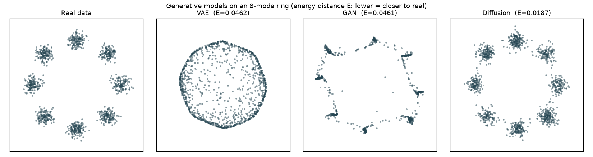

# Generative Modeling — VAE vs GAN vs Diffusion

The three generative paradigms — a **VAE**, a **GAN**, and a **DDPM diffusion**
model — each **built from scratch on a tiny NumPy autograd engine** (no PyTorch,
no TensorFlow) and pitted against the same target: a multi-modal 2-D **8-mode
Gaussian ring**. The ring is low-dimensional enough to plot and score exactly,
yet multi-modal enough to expose each model's signature failure mode. Sample
quality is measured with **energy distance** to the real distribution — so
"which looks best" becomes a number, not a guess.



## Why this project

- **Three paradigms, one engine.** A latent-variable VAE (encode → reparameterize
  → decode, reconstruction + KL loss), an adversarial GAN (generator vs.
  discriminator, non-saturating loss), and a DDPM diffusion model (predict the
  noise `ε_θ(x_t, t)`, reverse-sample) — all sharing the **same** autograd, Adam
  optimizer, and MLP.
- **Their signature pathologies, made visible.** GAN *mode collapse*, VAE
  *over-smoothing*, and diffusion's slower-but-faithful coverage — readable at a
  glance on the ring.
- **A real metric.** **Energy distance** is a proper distributional divergence
  (0 ⇔ identical distributions), not an eyeballed scatter plot.
- **From-scratch internals.** Reverse-mode autodiff, the reparameterization
  trick, a numerically-stable BCE-with-logits for the non-saturating GAN loss,
  and a linear-β DDPM noise schedule — all in a few hundred lines you can read.

## Quick start

```bash
python3 -m venv .venv && source .venv/bin/activate   # optional but recommended
pip install -r requirements.txt

python3 src/generate_data.py    # sample the 8-mode ring  -> data/samples.csv
python3 src/compare.py          # train all three, plot, score
```

…or just run everything:

```bash
./run.sh
```

Training all three models takes roughly **15–20 seconds** on a laptop CPU.
Each model can also be run standalone, e.g. `python3 src/diffusion.py`.

## Example output

```text
$ python3 src/compare.py
training VAE ...
training GAN ...
training diffusion ...
energy distance: {'VAE': 0.0462, 'GAN': 0.0461, 'Diffusion': 0.0187} | best: Diffusion
See reports/samples.png and reports/metrics.json
```

Diffusion covers all eight modes most faithfully; the GAN is sharp but patchier;
the VAE covers everything but smooths the modes together. (Exact numbers vary a
little with NumPy version and seed — GAN scores in particular are high-variance.)

**Outputs**

| File | What it is |
|---|---|
| `reports/samples.png` | Real vs. VAE vs. GAN vs. diffusion scatter panels |
| `reports/metrics.json` | Energy distance per model (lower = closer to real) |

## Components

| Model | File | Core idea |
|---|---|---|
| VAE | `src/vae.py` | encode → reparameterize → decode; reconstruction + KL loss |
| GAN | `src/gan.py` | generator vs. discriminator; non-saturating, stable BCE-with-logits |
| Diffusion | `src/diffusion.py` | predict noise `ε_θ(x_t, t)`; reverse-sample from noise |
| Compare | `src/compare.py` | train all three, plot panels, score by energy distance |
| Autograd | `src/autograd.py` | reverse-mode tensor autograd over NumPy |
| Shared | `src/common.py` | MLP, Adam, data loading, energy distance |

## Project structure

```
generative-models-vae-gan-diffusion/
├── data/
│   └── samples.csv          # 8-mode ring target (generated)
├── src/
│   ├── autograd.py          # reverse-mode tensor autograd engine
│   ├── common.py            # MLP, Adam, data loading, energy distance
│   ├── generate_data.py     # sample the target distribution
│   ├── vae.py               # variational autoencoder
│   ├── gan.py               # generative adversarial network
│   ├── diffusion.py         # DDPM diffusion model
│   └── compare.py           # train all, plot, score
├── reports/                 # samples.png, metrics.json (generated)
├── requirements.txt
├── run.sh
├── torun.txt
├── LICENSE
└── README.md
```

## How it works

- **Target** (`generate_data.py`) — 2,400 points drawn from 8 Gaussian modes
  spaced evenly on a circle of radius 2.
- **Autograd** (`autograd.py`) — a minimal `Tensor` recording a backward closure
  per op (add, mul, matmul, relu, tanh, sigmoid, exp, log, softmax, sum), with
  `backward()` walking the graph in reverse topological order. Broadcasting is
  undone in the backward pass.
- **Scoring** (`common.py`) — energy distance on random subsamples:
  `2·E‖X−Y‖ − E‖X−X′‖ − E‖Y−Y′‖`, which is 0 iff the two distributions match.

## Requirements

- Python 3.9+
- `numpy >= 1.26`, `matplotlib >= 3.7` (see `requirements.txt`)

## Scaling to real data

The same three recipes scale to images with convolutional encoders/decoders
(VAE), a DCGAN, and a U-Net diffusion backbone in PyTorch — the losses and
sampling logic stay exactly the same. This repo keeps the math visible by
running on 2-D toy data with a hand-written autograd.

## License

[MIT](LICENSE) © 2026 Sai Kushal
